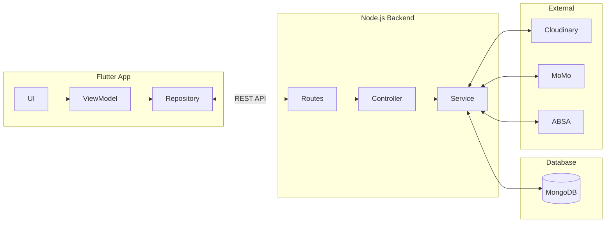
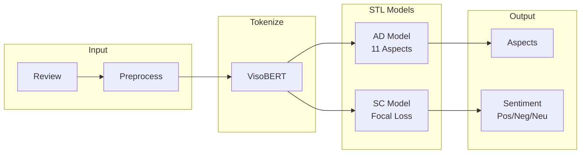
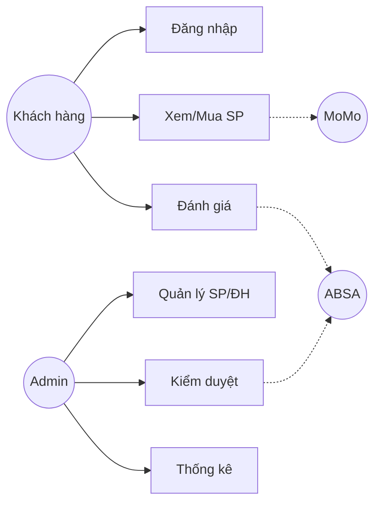

# Mermaid Diagrams - VeritaShop

## 1. Sơ đồ Kiến trúc Hệ thống

---

## 2. Kiến trúc STL cho ABSA

---

## 3. Sơ đồ Use Case

---

## Hướng dẫn

1. Vào https://mermaid.live/
2. Paste code → Export PNG
3. Lưu: `1.png`, `6.png`, `2.png`

